# Atlassian Forge DevTools

Browser extension that provides DevTools for Atlassian Forge apps.

## Download

- [Download for Chrome](https://chromewebstore.google.com/detail/atlassian-forge-devtools/nofccjajldmajgiidomkffhdecihiaig)
- [Download for Firefox](https://addons.mozilla.org/addon/atlassian-forge-devtools)
- [Manual download](https://github.com/JoaoBrlt/atlassian-forge-devtools/releases)

## Features

- View Forge Function invocations.
- View Forge Remote invocations.
- View Forge tRPC requests.
- Edit and resend requests.
- Filter requests by name.
- Configure the visible columns.
- Import HAR files.
- Export HAR files.

## Preview

### Forge Function invocations

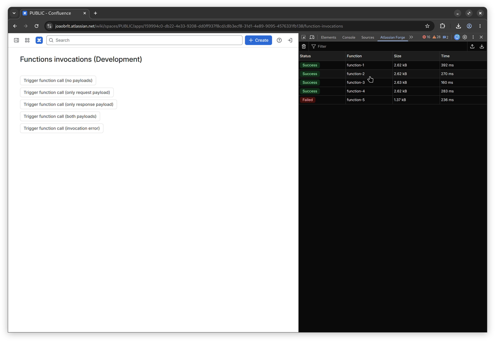
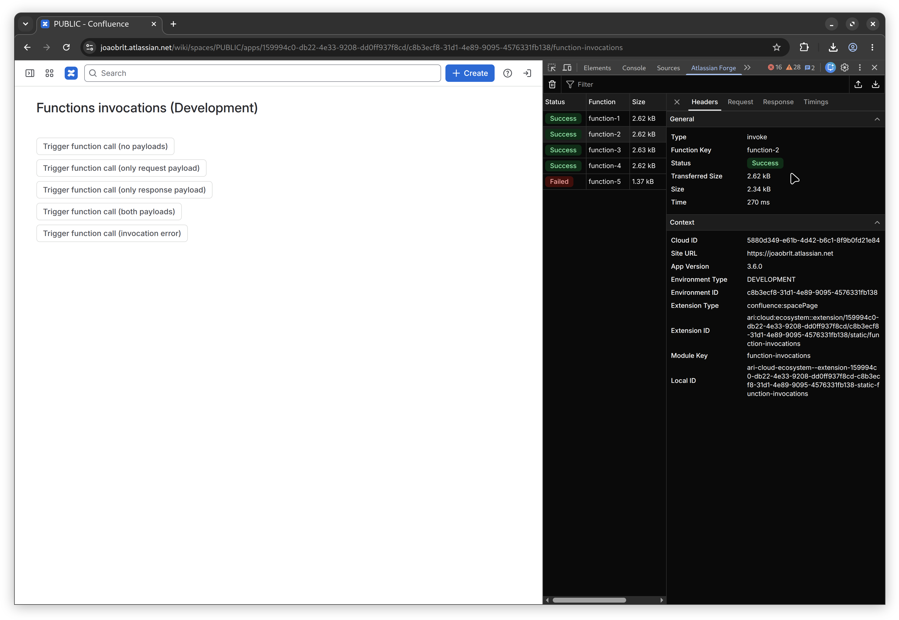

### Forge Remote invocations

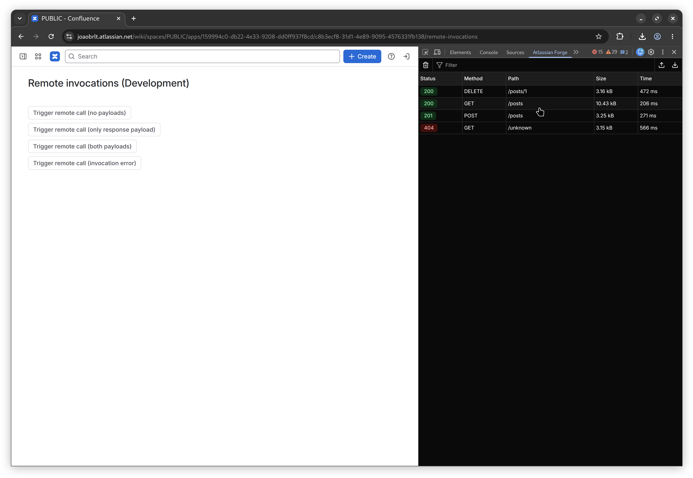
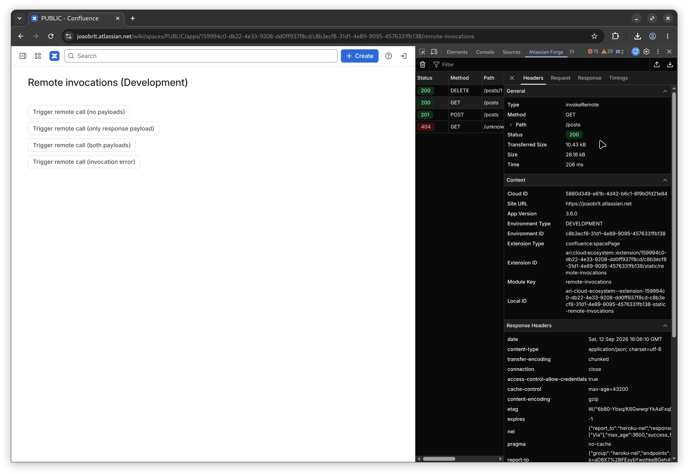
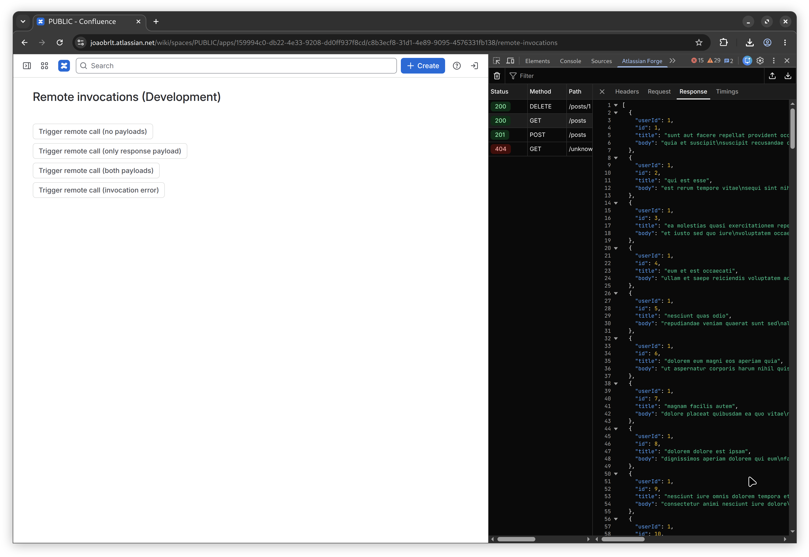

### Forge tRPC requests

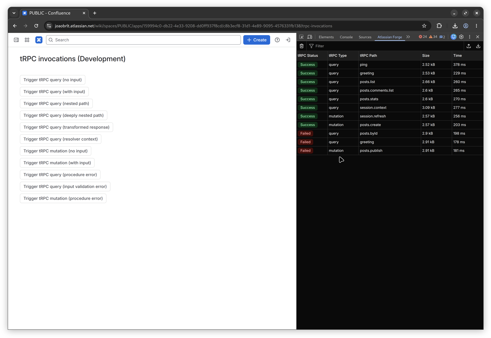
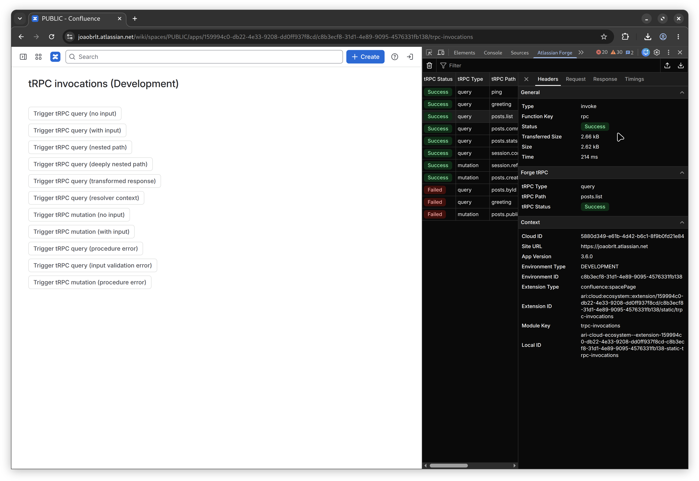
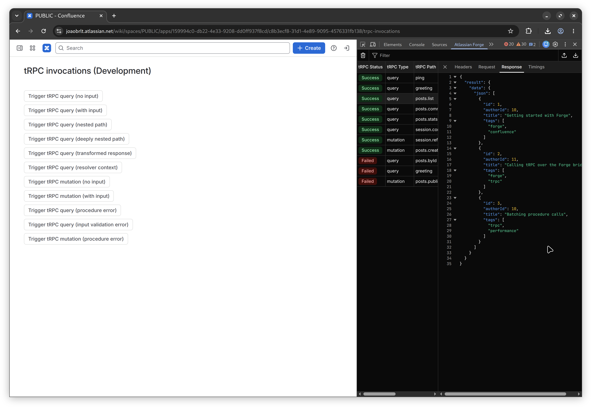

### Filter requests by name

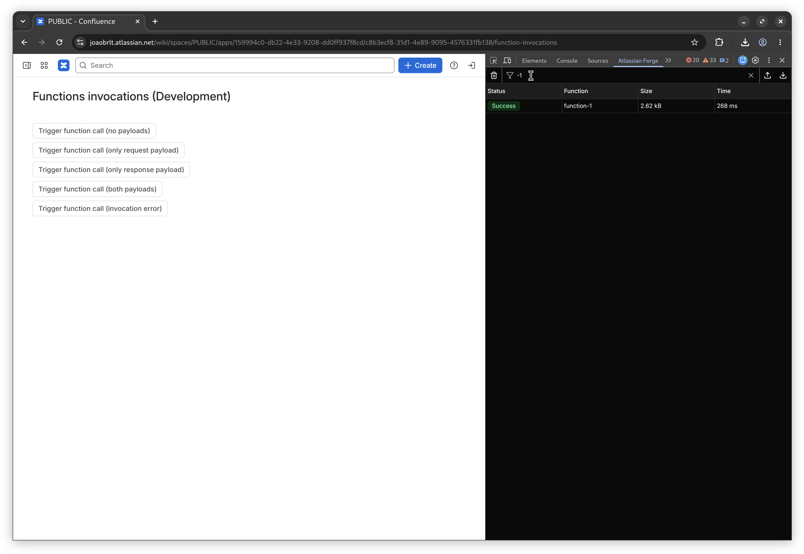

### Configure the visible columns

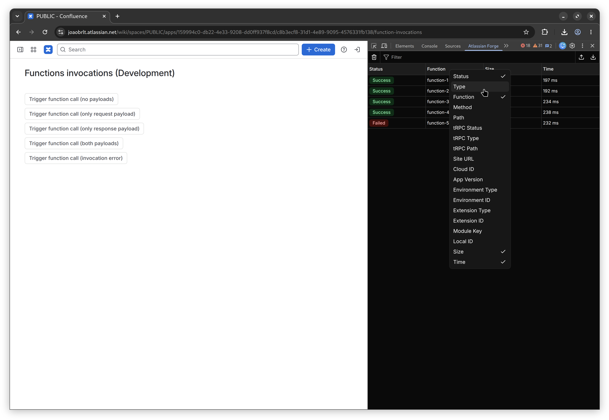

### Edit and resend requests

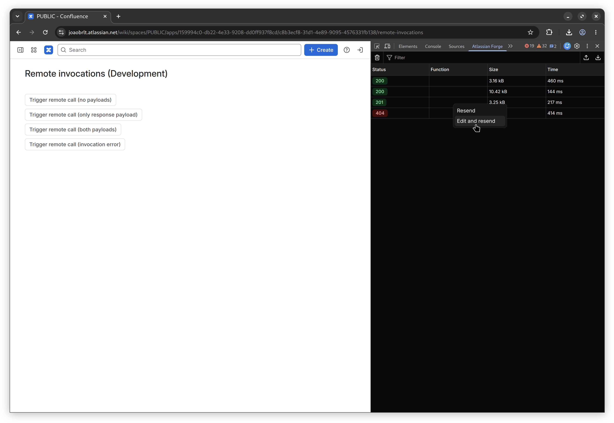
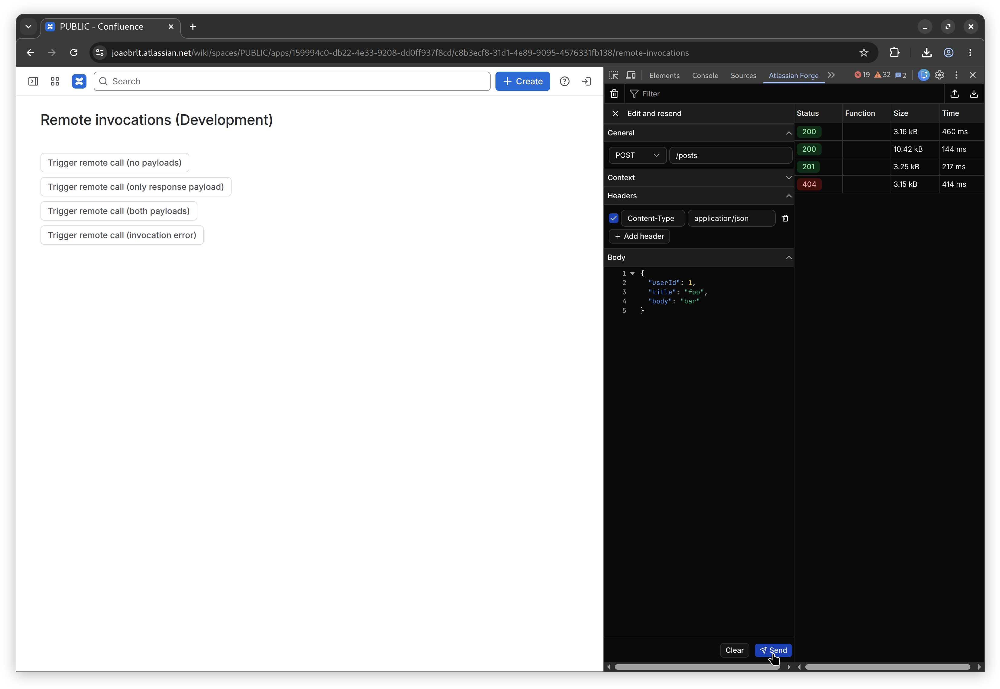

### Import and export HAR files

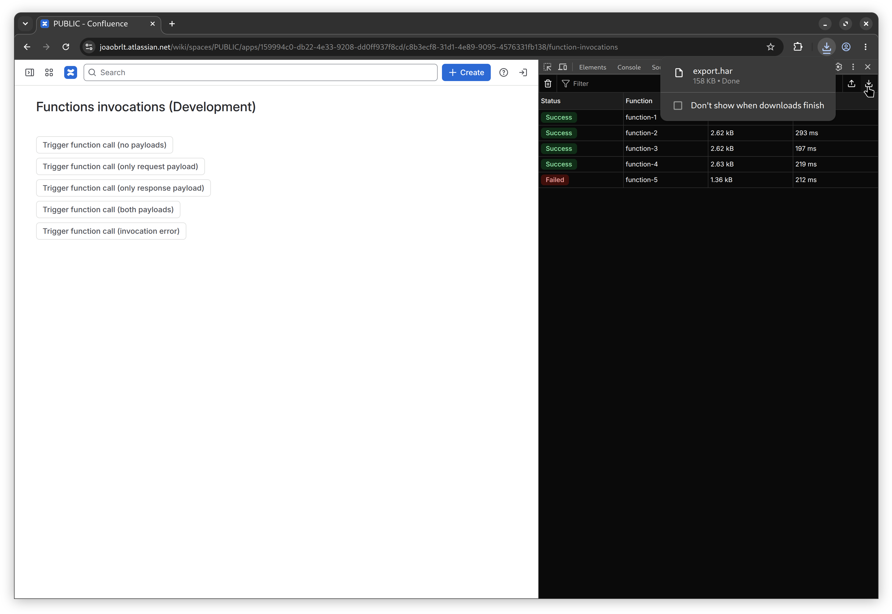

## Disclaimer

This project is an independent, community-developed tool and is not affiliated with, endorsed by, or associated with Atlassian in any way.

"Atlassian", "Forge", "Jira", "Confluence", and other Atlassian product names are trademarks or registered trademarks of Atlassian Pty Ltd.
All trademarks, service marks, and company names are the property of their respective owners.

Use of these names is purely for descriptive purposes, to identify the platform this tool is designed to work with, and does not imply any sponsorship or official relationship with Atlassian.

## License

This project is licensed under the GPLv3 License - see the [LICENSE](LICENSE) file for details.
